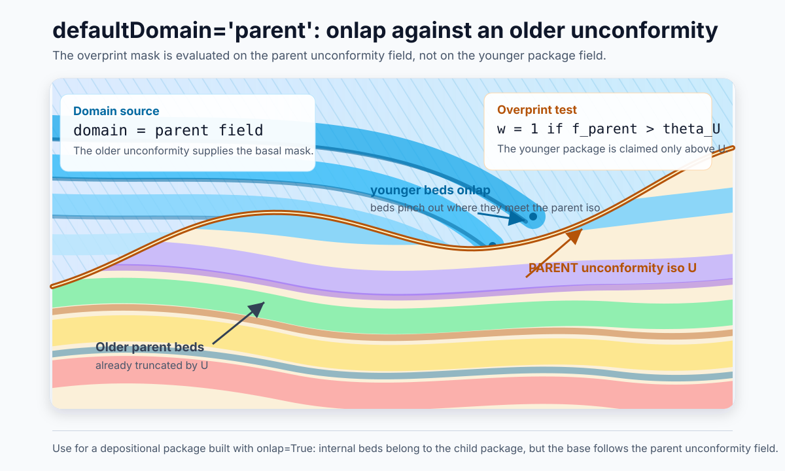
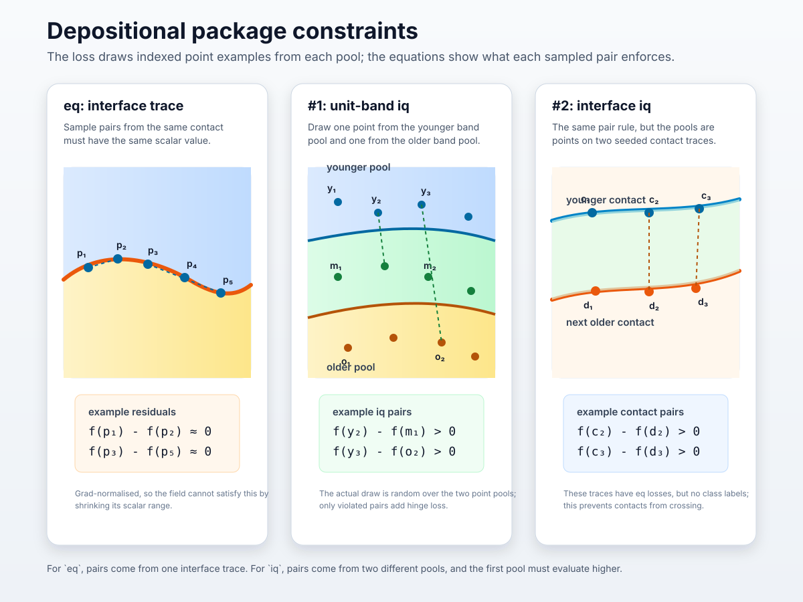
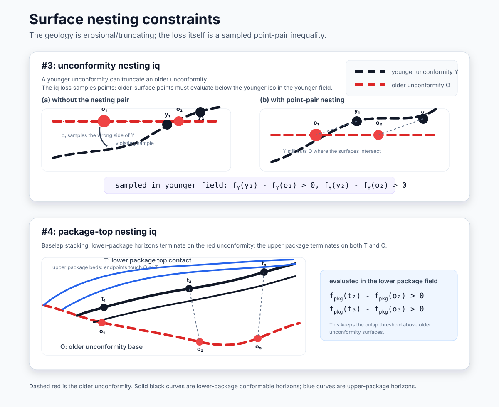
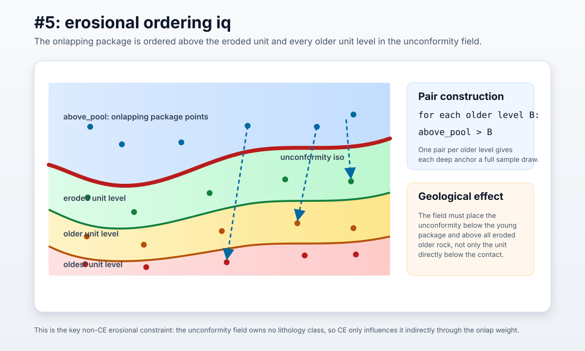
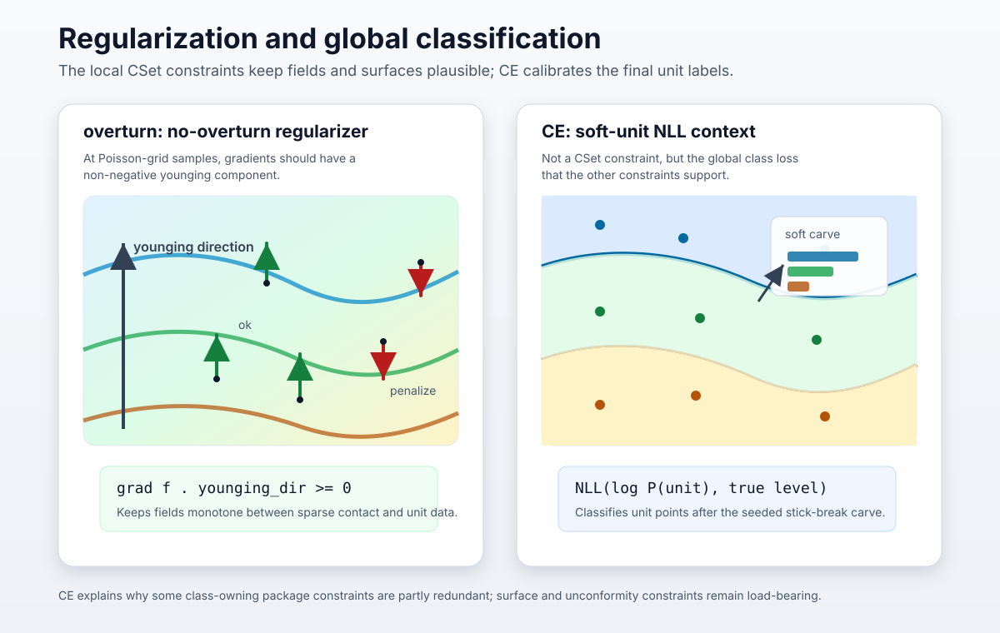

# GeoINR → Curlew integration — how it works

A readable, illustrated walkthrough of the runtime behaviour. For the *decisions* see
[SPEC.md](SPEC.md); for the soft-unit *design rationale* see [SOFTUNIT_SPEC.md](SOFTUNIT_SPEC.md);
for *current status & open items* see [SOFTUNIT_STATUS.md](SOFTUNIT_STATUS.md).

The integration turns a **stratigraphic column + point observations** into a fitted
Curlew `GeoModel`, using GeoINR's neural fields and (for unit data) GeoINR's
**unit / NLL coupling**, but reusing Curlew's native event graph, constraints and `predict`.

```
strat_col.csv + observations
        │  build_geomodel()                       (curlew/geology/stratbuilder.py)
        ▼
   GeoModel  =  graph of GeoEvents (oldest → youngest)
        │  fit
        ├── on-surface data  → per-field eq/iq/grad losses        (multilayer_fold)
        ├── unit-only data   → attach_unit_loss() joint CE        (wcsb)
        └── interface+unit   → attach_unit_loss(seed_isos=True)   (skmb)
        ▼  predict  (sequential overprint combine — unchanged Curlew machinery)
   Geode  (scalar, lithoID, structureID, surfaces, …)
```

## File map

| Concern | Where |
|---|---|
| Neural fields (`GeoINR` MLP, `Siren`) + their losses | [curlew/fields/geoinr.py](curlew/fields/geoinr.py) |
| Strat-column → event-chain builder | [curlew/geology/stratbuilder.py](curlew/geology/stratbuilder.py) |
| Unit / NLL coupling (carve, `UnitLoss`) | [curlew/geology/softunit.py](curlew/geology/softunit.py) |
| Event, overprint, combine (Curlew core — untouched) | [geoevent.py](curlew/geology/geoevent.py), [interactions.py](curlew/geology/interactions.py), [core.py](curlew/core.py) |
| wcsb notebook (unit-only, learnable isos) | [examples/wcsb/_build_notebook.py](examples/wcsb/_build_notebook.py) |
| skmb notebook (interface+unit, seeded isos, baselap-onto-conformal) | [examples/skmb/_build_notebook.py](examples/skmb/_build_notebook.py) |

---

## 1. The event chain

`build_geomodel` parses the column (youngest-first), partitions it into **scalar fields**
(one neural field per *package* or *unconformity*), and reverses to oldest→youngest. For
unit-only data it emits an **alternating chain** with synthesized *region-only* events at
both ends. wcsb (abbreviated):

```
 oldest                                                              youngest
 ┌──────────┐ ┌────────────┐ ┌────────┐ ┌────────────┐      ┌────────────┐ ┌──────────┐
 │ region   │ │ erosional  │ │ depo   │ │ erosional  │ ...  │ erosional  │ │ region   │
 │Precambri.│ │Precamb.Unc.│ │Cambrian│ │Sil/Ord Unc.│      │BellyRiv Unc│ │Quaternary│
 │ L37      │ │  (no unit) │ │ L35,36 │ │  (no unit) │      │  (no unit) │ │  L2      │
 └──────────┘ └────────────┘ └────────┘ └────────────┘      └────────────┘ └──────────┘
   alias of ───┘                                                    └─── alias of
```

Three event kinds (each one `strati(...)` `GeoEvent`, each owning one neural field):

- **depositional package** — a run of conformable units (e.g. Cambrian = levels 35,36).
  Owns one field; its internal contacts become learnable isosurfaces.
- **erosional unconformity** — a single surface that *truncates* older geology. Owns a
  field but **no lithology** (it's a surface, not a unit); just a threshold.
- **region-only** — basement / dropped-top unit. One lithology, **no constraints of its
  own**; its field is an *alias* (§3).

`M.field_meta[i]` (a `_FieldMeta`) describes event `M.events[i]`: its `kind`,
`is_unconformity`, the unit `levels` it owns, and bookkeeping for the constraints.

---

## 2. Onlap: `child` vs `parent` (the key structural idea)

Every generative event has an `Overprint` that decides, point-by-point, where this event's
rock replaces the older rock below it. The **domain** of that decision is one scalar field,
chosen by `Overprint.defaultDomain`:

**`defaultDomain='child'` — erosional truncation.** The boundary is *this event's own* field: the
unconformity's own iso is the cut surface, and it bevels the older beds beneath. An erosional
unconformity **owns no rock of its own** (every erosional event has `owns_band=False`, verified on
the model), so it enters the combine as a **two-step** build — which is the key to reading these
two panels:

1. **Cut step (this `child` event).** With `mode='above'` it claims everything *above* its iso and
   overprints it with **its own field** — so in this step the region above is layered ≈*parallel to
   the cut* (it **is** the unconformity's field). Below the iso the older beds are kept; above, they
   are removed. This is the truncation.
2. **Fill step (the younger package, `parent`).** The depositional event *younger* than the
   unconformity then overprints that same region and **replaces** it with its own beds — which
   **baselap onto the cut and need not be parallel to it** (they pinch out against the surface; the
   `parent` case below).

So the *overlying* beds are **not** generally parallel to the unconformity — that parallel look is
only the transient cut-step field, which the younger package overwrites. The figure below shows the
**cut step**; the `parent` figure shows the fill step.


(The same `child` mechanic, when the event *does* own rock — a conformable series in
`multilayer_fold`, or the basement with `base=−∞` — instead deposits its *own* beds above its base.
In the skmb/wcsb chain the only `child` events are the basement and the erosional truncations.)

**`defaultDomain='parent'` — onlap.** The boundary is the *parent* (the older unconformity
it sits on). Younger beds lap onto — and pinch out against — that older surface.



The orange surface is the parent unconformity's isosurface. The younger package still owns
its internal bedding field, but its basal overprint mask is evaluated on the parent field, so
the package thins and terminates against that older surface.

In the builder ([`strati(..., onlap=True)`](curlew/geology/__init__.py)):

| event | mode | `defaultDomain` | overprint domain field |
|---|---|---|---|
| erosional unconformity | `above` | `child` | its **own** field |
| depositional package (onlaps the unconformity below it) | `above` | `parent` | the **unconformity** field below it |
| depositional package (**baselap onto conformal package**, skmb) | `above` | `parent` | the **lower package's top** isosurface |
| region-only basement (oldest) | `above`, `base=-inf` | `child` | — (claims everything below) |
| region-only top (onlaps youngest unconformity) | `above` | `parent` | the youngest **unconformity** field |

This table *is* the rule the carve (§5) and `predict` both follow.

**Baselap onto a conformal package (skmb).** When a `baselap` unit is followed (older) by a
`conformal` unit, it sits at the **base of an upper package** that laps onto the **top of the
conformal package below** — not an unconformity. `derive_scalar_fields` splits the run at the
baselap (`_package_end`); the lower package is given a **top isosurface** (seeded from its
youngest contact's interface points), and the upper package onlaps it with the *same*
`parent`-domain mechanism above (just a depositional top instead of an unconformity). In skmb
this is the Westgate→Viking, Torquay→Birdbear, 1stRedBed→DawsonBay and Winnipegosis→Ashern
relationships. wcsb has no such case (every wcsb baselap is followed by `eroded`), so its
partition is unchanged.

### How the column relations choose the domain

The `relation` column (`conformal` / `baselap` / `eroded`) is what drives the `child`/`parent`
choice, by one rule per relation:

| pattern in the column | becomes | overprint domain |
|---|---|---|
| `eroded` | an **erosional unconformity** event — *truncates* older rock, owns no band | **`child`** (its own field) |
| a package whose base sits on an `eroded` below it | a depositional package that **onlaps the unconformity** | **`parent`** (the unconformity field) |
| a `baselap` whose next-older unit is `conformal` (baselap-onto-conformal) | a depositional package that **onlaps the lower package's top** | **`parent`** (the lower package's top iso) |
| the oldest unit(s), below the deepest `eroded` | the **basement** region | `child`, `base=−∞` (claims everything below) |

So **every `eroded` adds one `child` truncation; every package adds one `parent` onlap.** Worked
on your two examples (youngest→oldest, build order shown oldest→youngest):

**`conformal, baselap, eroded, conformal`**
- oldest `conformal` → **basement** (`child`, `base=−∞`)
- `eroded` → **unconformity** (**`child`** — truncates the basement)
- `{conformal, baselap}` → package **onlapping that unconformity** (**`parent`**)

**`conformal, baselap, conformal, conformal, baselap, eroded, conformal`**
- oldest `conformal` → **basement** (`child`)
- `eroded` → **unconformity** (**`child`**)
- `{conformal, conformal, baselap}` → package **onlapping the unconformity** (**`parent`**)
- `{conformal, baselap}` → upper package, **baselap-onto-conformal**, **onlapping the lower
  package's top** (**`parent`**)

The key reading: **`parent` (onlap) is the general case** — one per package, in *both* sequences;
baselap-onto-conformal is just a `parent` onlap onto a package **top** instead of an unconformity.
**`child` is the `eroded` unconformity** (plus the basement) — a truncation that owns no rock, with
the younger package filling above it.

---

## 3. Region-only events & `_AliasField`

A region-only event (basement, dropped-top unit) has **one lithology and no data of its
own** — it only needs to label its region and supply its points as references. Rather than
give it a random untrained network, its field is a loss-free **`_AliasField`** of the
*adjacent unconformity's* field:

```
  Precambrian (basement, L37)        evaluates  ≡  Precambrian-Unconformity field
                                                     (continued below the iso)
```

Why an alias and not the same object?
- **GeoINR's basement treatment:** the basement domain is classified by the *unconformity's*
  field + iso, so continuing that fitted field downward is the geologically meaningful scalar.
- **No double-optimisation / no Pebble clash:** the alias owns **no parameters** and its
  `C is None`, so `loss()` returns an empty `Pebble`. (Curlew's `Pebble` refuses duplicate
  loss keys when `GeoModel.fit` sums per-event losses, so a *shared field object* would
  raise — a loss-free alias sidesteps that.)

Valid because the region-only event is stratigraphically adjacent to its target with no
deformation between them, so their reference frames coincide. (This is why a region-only
event shows **no constraints / no loss** when you inspect it — that's by design.)

**Doubled unconformities (skmb).** When two `eroded` units are adjacent in the column (e.g.
Sub_Success then Sub_Cantuar), the rock of the **older** one is preserved as a thin unit
*sandwiched between the two unconformity surfaces*. It gets its **own region-only event** that
**onlaps the older unconformity** below it and is **truncated by the younger** one above it, so
it fills the `[older-iso, younger-iso]` band. Without it that band is claimed by no event — a
**void** in `predict` (the older unconformity truncates everything above its iso, but the next
onlapping package only fills above the *younger* iso). Its field aliases the older
unconformity's, exactly like the basement/top regions.

---

## 4. Constraints per event — and why `iq` looks the way it does

For unit-only data there are no on-surface points, so each field is constrained by
**point-vs-point inequalities** (`CSet.iq`). For an **erosional** event the rule is:

> the package that **onlaps** the unconformity sits **above** the eroded unit **and every
> older unit** — so the surface is pinned below the young package and above all old rock.

In code ([`_build_erosional_event`](curlew/geology/stratbuilder.py)) the *above* side is
**pooled into one tensor** and there is **one pair per older level**:

```
iq[1] = [ (above_pool, level_B_points, '>')  for B in (eroded unit … oldest) ]
          └ lhs ┘     └─── rhs ───┘    └ '>' ┘
```

So for the **youngest** unconformity (*Belly River*, event 13) you see **~35 pairs**, each
`(Quaternary_points  >  one older unit's points)`. **Your reading is exactly right:** the
single onlapping unit (Quaternary, the dropped top) is required to be above *every* older
unit, which forces the unconformity's field below Quaternary and above all the rock it
eroded into. (`'>'` everywhere because "younger is higher-valued".) The `_FieldMeta.iq_relations`
records the same thing in level form for the notebook's §3 listing.

A depositional package instead gets adjacent-band pairs (band *j* `>` band *j+1*); a
region-only event gets none.

> ⚠️ **The `iq` weight differs by path.** On the **unit-only (wcsb)** path
> `attach_unit_loss` sets `iq_norm_weight = 0` — the cross-entropy (§5) supersedes the
> inequalities, so they survive only to size the per-level pools + feed §3 inspection
> (*vestigial*, a cleanup candidate). On the **seed-iso (skmb)** path it keeps
> `iq_norm_weight = 1` — there the inequalities are **active loss terms** that order the
> interface-defined surfaces where the CE is silent. The full seed-iso constraint set is
> tabulated next.

### The complete constraint set (seed-iso / skmb path)

Every constraint below is **active** in the loss. The right-hand column is the key design
point: a constraint is **redundant with the CE only when it lives on a class-owning
(depositional) field**, because the CE classifies those bands directly; constraints on an
**unconformity field (which owns no class)** are *not* implied by the CE — it only shapes
that field through its onlap weight `w = σ(s·(f−θ))`.

| # | constraint (`CSet`) | on field | enforces | redundant w/ CE? |
|---|---|---|---|---|
| `eq` | **interface** | every seeded surface | `f` == contact value at on-surface points (grad-normalised) | no — *defines* the surfaces; nothing else pins them |
| #1 | within-package **unit-band** `iq` | depositional *(class-owning)* | younger band's unit-pts `>` older band's unit-pts | **largely yes** — CE classifies these bands ⇒ ordering implied |
| #2 | within-package **interface** `iq` | depositional | younger contact's on-surface pts `>` next-older contact's | no — surfaces carry no CE signal |
| #3 | **unconformity nesting** `iq` | erosional | this unconformity's surface pts `>` *each older* unconformity's (1 pair/older surface) | no — surfaces carry no CE |
| #4 | **package-top nesting** `iq` | depositional | package's top contact `>` *each older* unconformity surface | no — the top is a baselap onlap threshold (§2) |
| #5 | **erosional ordering** `iq` | erosional *(weight field)* | onlapping pkg's pts `>` eroded unit **and every older unit level** (1 pair/level) | **no** — unconformity field owns no class; CE only shapes it via `w` |
| `overturn` | **no-overturn** reg. | every field | `∇f·(younging dir) ≥ 0` on the Poisson grid (weight **12** on this path, §6) | no — controls deep, data-sparse regions |
| `CE` | **soft-unit NLL** | the global carve | unit points classified by the seeded stick-break (§5) | — *(this is the CE)* |

### Visual guide to the constraints

The panels below match the table rows. The repeated rule for every `iq` panel is:
the first pool in the pair must evaluate higher than the second pool; once a pair is
satisfied, the hinge contributes no gradient.



*`eq` defines seeded surfaces from contact data. #1 orders unit bands in a class-owning
package field. #2 orders the seeded contact surfaces themselves, which CE does not see.*



*#3 and #4 are the cross-surface guards. They keep younger erosion/onlap thresholds from
reaching down through older unconformities at sparse margins or in deep regions. A younger
unconformity may still truncate an older one; the constraint is evaluated at sampled surface
points in the relevant field.*



*#5 is the load-bearing unit-point inequality on an erosional field: the onlapping package
must be above the eroded unit and all older levels, not just the immediately adjacent one.*



*`overturn` keeps each scalar field monotone between sparse observations. `CE` is not a
`CSet` constraint, but it is the global class loss that makes the seeded carve honour the
observed unit labels.*

`eq` pins each surface to its data; #2–#4 keep the **surfaces** ordered where the data is
silent; #5 keeps the **unconformity fields** ordered against the older column; `overturn`
keeps every field monotone *in between*; the `CE` calibrates the unit classification. #1 is
the one term implied by another (the `CE`) — kept to match the committed baseline, a
removal candidate.

---

## 5. The unit / NLL coupling — training carve vs inference combine

This is the heart of the wcsb path, and the key idea is a **duality**:

| | **Training** (`UnitLoss`) | **Inference** (`GeoModel.predict`) |
|---|---|---|
| what | global per-point **soft carve** → `(N,C)` simplex | Curlew's **sequential overprint combine** |
| robust to | deep/ambiguous points (one global decision) | — (fragile if fields aren't monotone) |
| signal | cross-entropy vs true unit **levels** | hard `lithoID` |
| code | [`soft_unit_probs`](curlew/geology/softunit.py) | [`Geode.combine`](curlew/core.py) (unchanged) |

They are kept consistent: the carve uses the **same fields** (evaluated through
`ev.predict(combine=False, transform=True)`, so faults/deformation still apply) and the
**same iso-values**, which are written back after fitting so `predict` reproduces the carve.

### The carve (`soft_unit_probs`) — a per-class re-derivation of `combine`

Youngest→oldest stick-break. `remaining` starts at 1; each **class-owning** event claims
a share and passes the rest down. `s = 1/τ` (τ = 0.05 ⇒ s = 20).

```
remaining = 1
for each class-owning event E, youngest → oldest:
    w = σ( s · ( f_domain(E) − θ_domain(E) ) )     # domain per the §2 table
    claim = remaining · w
        depositional → split `claim` across its bands by f_E and its contacts θ₁>…>θₘ
        region-only  → all of `claim` to its one class
    remaining = remaining · (1 − w)
# the oldest basement (w=1) takes whatever `remaining` is left
return  probs / probs.sum()                          # already ≈1
```

```
            f_BellyRiver                f_Precambrian-Unc.
 Quaternary ─►σ(...)              Cambrian ─►σ(...)            Precambrian
   claim = remaining·w              claim = remaining·w          claim = remaining (w=1)
   remaining ·= (1−w)               remaining ·= (1−w)
   └────────────── each unconformity truncates exactly ONCE ──────────────┘
```

**Why erosional events are _not_ steps here (the bug that was fixed):** an unconformity's
truncation is *already* applied by the package that onlaps it (whose `w` uses that same
unconformity field+iso, per §2). Treating the erosional event as its own step too would
(a) truncate twice `(1−w)²` and (b) discard `remaining·w·(1−w)` of probability that then
gets renormalised — which lets the CE cheat by driving `w→0.5` to inflate the true-class
prob without separating units (a degenerate minimum that got *worse* with training). So the
carve only steps class-owning events; each surface truncates once. (wcsb's chain is strictly
alternating with zero orphan unconformities, so this is exact.)

### Iso-values: learned, monotone, written back

Iso-values are **learnable Parameters owned by `UnitLoss`**, not scattered through core:
- each **unconformity** has one free threshold;
- each **package**'s internal contacts use a **monotone reparam**
  `θⱼ = θ₀ − cumsum(softplus(φ))` ([`monotone_contacts`](curlew/geology/softunit.py)) — so
  contacts are descending **by construction** (a band can pinch to zero thickness but two
  contacts can never cross), which also makes the band probabilities valid without clamping.
- init is **uniform** (θ₀≈+1, even gaps); correctness is owned by the reparam + CE, so the
  init is only a convergence aid.

After `M.fit(custom_loss=[uloss])`, `uloss.write_isosurfaces(M)` pushes the learned values
into ordinary `addIsosurface(value=...)`, **oldest-contact-first** (so ascending `lithoID`
= younger), and `predict` works as usual. **`estimate_isosurfaces` is not used on this path.**

### Iso-values: seeded from interfaces (skmb, `seed_isos=True`)

When the observations include **on-contact (interface) points** as well as unit points
(skmb), the iso-values are **not learned** — they are read directly from the data. Each
surface (every conformal contact, every package top, every unconformity) gets an `eq` trace
+ a **seed isosurface** from its interface points at build time; the field's `eq_norm` loss
pins it there. `attach_unit_loss(M, seed_isos=True)` then builds a `UnitLoss` that owns **no
iso parameters**: its carve reads each threshold as the field's value over that surface's seed
points each step (`resolve_isos(model)`, grad-carrying through the field), so the unit points
still drive the cross-entropy but the contacts stay pinned to the interface data. Nothing is
written post-fit — the seeds resolve directly at `predict` (no `write_isosurfaces` /
`estimate_isosurfaces`). The monotone reparam is unnecessary (the data orders the contacts);
`soft_unit_probs` `clamp_min(0)`s the bands as a cheap guard against a rare local inversion.

**Surface ordering.** On this path `attach_unit_loss` keeps `iq_norm_weight` **on for every
field** — the gradient-normalised inequalities *order the surfaces* where the CE is silent (the
CE only constrains unit points; the surfaces, defined by interface points, carry no CE signal,
and their deep/margin regions are unit-sparse). Two kinds:

- **within a package** — a younger contact's on-surface points sit `>` the next-older contact's
  (in that package's field), so the seeded contacts keep stratigraphic order and cannot cross;
- **across unconformities (nesting)** — each unconformity's own surface points sit `>` every
  *older* unconformity's surface points (in its field), **one pair per older surface** so each
  (e.g. the Precambrian, whose margin points are sparse) gets a full sample draw rather than a
  fraction of one pooled set. This keeps the older surfaces below a younger iso, so a younger
  unconformity cannot erode below an older one;
- **package tops (nesting)** — a **baselap-onto-conformal** package onlaps the *lower package's
  top iso* (§2), so that top surface is an onlap threshold too. Each package's top contact
  therefore also nests `>` every older unconformity surface — otherwise the lower package's
  field floats above its top iso at the basin margin and the upper baselap package reaches down
  and erodes below an older surface (measured on skmb: the baselap packages were the dominant
  cause of margin Precambrian-cutting; adding this drops it ~8×).

The `eq` loss pins each surface to its data; these `iq` terms keep the surfaces ordered where
the data is silent; `overturn` keeps each field monotone in between. The hinge is zero once
satisfied, so it does not fight the `eq`/CE fit — it only corrects ordering violations.

---

## 6. Tuning knobs (coupled path)

| knob | where | effect |
|---|---|---|
| `overturn_weight` | `attach_unit_loss(...)` | **the** trade-off: low → better marker fit + lower NLL, but more deep-region inversions in `predict`; high → cleaner volume, looser fit. Default **6** (per-field path uses 30). **Seed-iso path wants ~12**: the interface `eq` hard-pins fields at the contacts, and that curvature drives deep regions to overturn as training continues — at 6 the volume inversions *grow* with epochs, at 12 they *fall* (robust to long training); the interface `eq` already separates the bands so the stiffer prior costs only ~0.03 band. |
| `cap_per_unit` | `build_geomodel(...)` | distinct points each field sees. **Large/None** on the coupled path (balance comes from `points_per_level`, not the cap). |
| `points_per_level` | `attach_unit_loss(...)` | balanced points/level/epoch (default 1024). |
| `tau` | `attach_unit_loss(...)` | carve sharpness `s=1/τ` (default 0.05). |

---

## 7. Known limitations & future work

- **Vestigial `iq` on the _unit-only (wcsb)_ path.** There `attach_unit_loss` zeros
  `iq_norm_weight`, so the inequalities (§4) are *built but never used for the loss* — they
  only size the per-level pools and feed §3 inspection. Harmless but confusing when you inspect
  a field's `CSet.iq`; a future `build_geomodel` could skip building them. **(The seed-iso /
  skmb path is different — there `iq_norm_weight=1`, so the inequalities are active; see the §4
  table.)**
- **Within-package unit-band `iq` (#1) is redundant on the seed-iso path.** It orders a
  depositional package's own bands from the *unit* points, but the CE already classifies those
  bands (a correct classification implies the ordering). It is kept only to match the committed
  baseline; dropping it should simplify the constraint set with no quality loss (the genuinely
  load-bearing unit-point inequality is the erosional #5, which lives on a class-less
  unconformity field the CE cannot imply). A one-run isolation check would confirm before removal.
- **`overturn` is a single global knob** trading marker-fit against `predict` inversions (§6).
  A split by event kind (strong on unconformities, weak on packages) was tried and **did not**
  recover the basement — the deep leak is *iso placement*, not unconformity-field overturn — so
  it was dropped. A smarter, data-aware monotonicity prior remains open.
- **Marker-accuracy ceiling (~0.73 band on the full wcsb markers).** Dominated by the deep,
  densely-packed packages (Granite Wash / Mississippian internals); one neural field per package
  is the same structural limit GeoINR has, and these are its weakest levels too. (Reference-
  comparable; see SOFTUNIT_STATUS.md for the numbers.)
- **`softLithoID` volume artifact** (out of scope, SOFTUNIT_SPEC §8). `predict`'s differentiable
  `softLithoID` is a scalar blend of integer class IDs, so a categorical colormap paints thin
  shells of in-between units at boundaries. The carve already produces a clean `(N, C)` simplex —
  exposing it at inference for volume colouring is a possible later improvement.

See [SOFTUNIT_STATUS.md](SOFTUNIT_STATUS.md) for the measured numbers and the (now short) open-items list.
